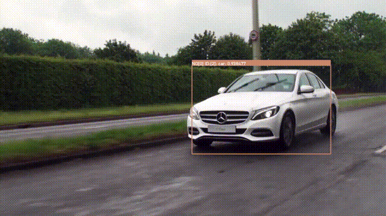
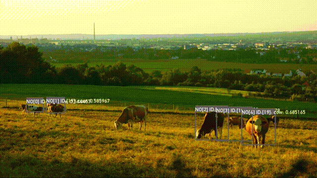

# ofxOpenCvDnnObjectDetection

## Description
ofxOpenCvDnnObjectDetection is an addon for openframeworks.
This is a 0.10 branch for openframeworks 0.10 version. If you are using latest version oF 0.11, use a master branch.

OpenCV v.3.3.1 or upper includes dnn module ( https://docs.opencv.org/3.4.1/da/d9d/tutorial_dnn_yolo.html ) in their own package. Therefore I designed ofxOpenCvDnnObjectDetection with OpenCV v.3.3.1 or upper version.

I created this addon for beginers or learner who are going to try object detection with Yolo, SSD and R-CNN on OF.

## Usage
See Examples for more details

### single_image

Detection example for single image.

### camera
Realtime Detection example for webcam video.

### annotation

My annotation software to export a yolo format. It enables you to annotate image, video, camera. I'm preparing the manual to use it.... not yet.

## Install
### 1. Clone ofxOpenCvDnnObjectDetection to your of/addon directory
    $ git clone https://github.com/TetsuakiBaba/ofxOpenCvDnnObjectDetection.git
### 2. Download OpenCV.framework to ofxOpenCvDnnObjectDetection/libs directory. 
    $ curl -O https://tetsuakibaba.jp/tmp/opencv2.framework.zip
    $ unzip opencv2.framework.zip
   
Or you may build your own opencv.framework from opencv source. ( http://tetsuakibaba.jp/ws/doku.php?id=opencv_dnn:opencv2.framework )

## Getting Started with Examples/single_image.
### 1. Download models
    $ sh getWeights.sh
### 2. Update single_image with the projectGenerator.
### 3. Run

## Sample result images

## Compatibility
- only macOS ( tested on Mojave)
- of version: 0.10.1

## Licence
- Source Code: [MIT](https://opensource.org/licenses/MIT)
- Videos
  - [Video by Pixabay from Pexels](https://www.pexels.com/video/cows-eating-856065/)
  - [Video by Pixabay from Pexels](https://www.pexels.com/video/mercedes-c-class-854710/)

## Author
[TetsuakiBaba](https://github.com/TetsuakiBaba)

## Reference
1. Model Zoo on OpenCV DNN Module README page: https://github.com/opencv/opencv/blob/master/samples/dnn/README.md
2. How to implement OpenCV Yolo on Openframeworks: https://qiita.com/buchayaty/items/4020100f531c07418f38

