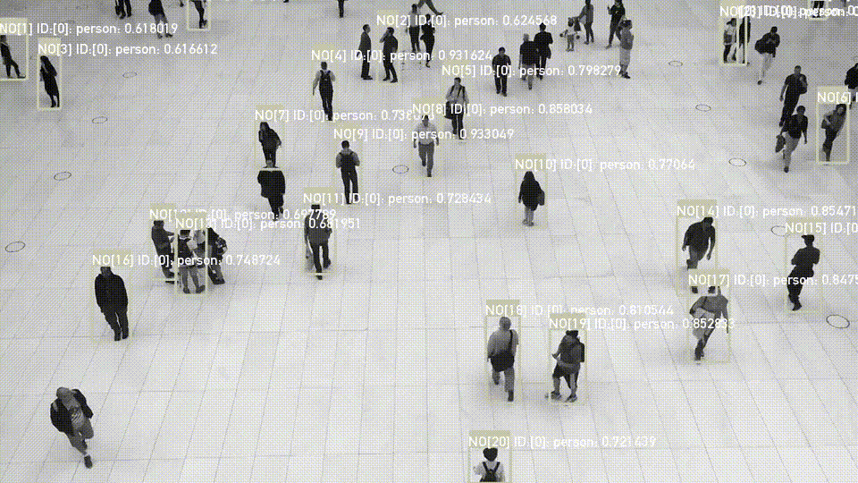

# ofxOpenCvDnnObjectDetection

## Description
ofxOpenCvDnnObjectDetection is an addon for openframeworks(version.0.11.0).

I created this addon for beginers or learner who are going to try object detection with Yolo, SSD and R-CNN on OF. Latest oF includes opencv(version4) as a default opencv library, so you can run dnn object detection with ofxOpenCv. 

## Usage
See Examples for more details

## Example
### single_image

Detection example for single image.

### camera
Realtime Detection example for webcam video.

### annotation

My annotation software to export a yolo format. It enables you to annotate image, video, camera. I'm preparing the manual to use it.... not yet.

## Getting Started with Examples/single_image.
### 1. Clone ofxOpenCvDnnObjectDetection to your of/addon directory
    $ git clone https://github.com/TetsuakiBaba/ofxOpenCvDnnObjectDetection.git
### 2. Download models
    $ sh getWeights.sh
### 3. Open a project generator and import Example/single_image. Then click the update button.
### 4. Open the project with IDE(xcode) and just run.

## Compatibility
- only macOS ( tested on Catalina 10.15)
- oF version: 0.11.0

## If you wanna get faster inference time.
Openframeworks(version.0.11.0) includes opencv-4.0.1 for ofxOpenCv addon. But you can get faster inference time by using local-compiled opencv library. Here is my inference time result on each dnn object detection.
Now I'm tring to compiling make a benchmark on M1 mac as soon as oF announced Arm64 bandle. 

| CPU Inference Time on MacBook Pro (13-inch Mid 2018) https://browser.geekbench.com/v5/cpu/1184669 | opencv.a (opencv-4.0.1, oF bundle) | opencv2.framework (opencv-4.2.0, local compiled)|
|:---|---:|---:|
|yolov3 (416x416,coco)      | 760 [ms] | 307 [ms] |
|yolov3-tiny (416x416,coco)|62 [ms] |27 [ms] |
|yolov2-tiny (416x416,coco)| 61 [ms] | 28 [ms] |
|MobileNet-SSD (300x300, voc)| 40 [ms] | 26 [ms]| 
|SSD        (300x300, coco) | 768 [ms] | 310 [ms]|

| CPU Inference Time on mac mini (M1 2020) https://browser.geekbench.com/v5/cpu/5044574 | opencv.a (opencv-4.0.1, oF bundle) | opencv2.framework (opencv-4.5, intel macbook pro(2018) compiled)| Arm64 |
|:---|---:|---:|---:|
|yolov3 (416x416,coco)      | 412 [ms] |  413 [ms] | -- [ms]|
|yolov3-tiny (416x416,coco)| 39 [ms] | 39 [ms] | -- [ms] |
|yolov2-tiny (416x416,coco)| 37 [ms] | 38 [ms] | -- [ms] |
|MobileNet-SSD (300x300, voc)| -- [ms] | -- [ms]| -- [ms]  |
|SSD        (300x300, coco) | -- [ms] | -- [ms]| -- [ms] |

### How to replace opencv.a to opencv2.framework
1. Copy opencv2.framework to ofxOpenCvDnnObjectDetection/lib directory
2. Edit addon_config.mk and comment out a line of #ADDON_INCLUDES  += libs/opencv2.framework
3. Import a project, such as single_image, camera, with projectgenerator then remove ofxOpenCv from addon list. 
4. update and run.
----
## Licence
- Source Code: [MIT](https://opensource.org/licenses/MIT)
- Videos
  - [Video by Pixabay from Pexels](https://www.pexels.com/video/cows-eating-856065/)
  - [Video by Free Videos from Pexels](https://www.pexels.com/video/black-and-white-video-of-people-853889/)
  - [Video by Pixabay from Pexels](https://www.pexels.com/video/mercedes-c-class-854710/)

## Author
[TetsuakiBaba](https://github.com/TetsuakiBaba)

## Reference
1. Model Zoo on OpenCV DNN Module README page: https://github.com/opencv/opencv/blob/master/samples/dnn/README.md
2. How to implement OpenCV Yolo on Openframeworks: https://qiita.com/buchayaty/items/4020100f531c07418f38

